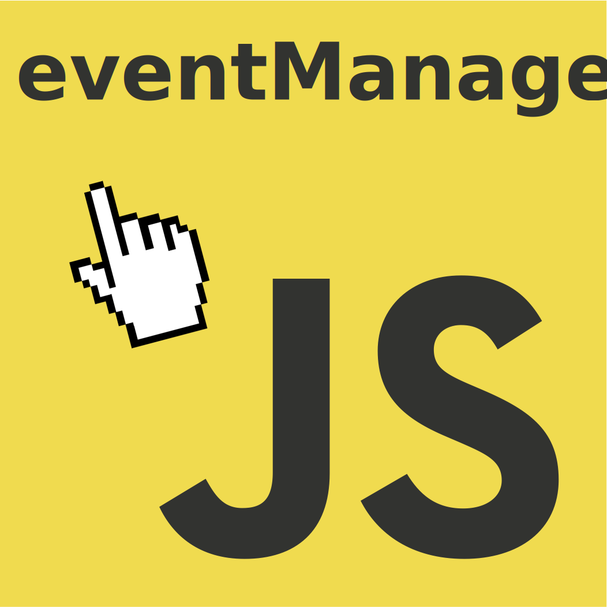

<p style="text-align: center;">

</p>
<br>

# eventManager

> <b>eventManager</b> es una pequeña librería escrita en javascript diseñada para capturar y manejar eventos del DOM y re asignarles funciones definidas por usted. Es simple y poderosa y solo pesa solo 1Kb.

También puede leerlo en: [English](README.md)

## Puede ver una [demo online](https://galiprandi.github.io/eventManager/).

---

### Modo de uso:

#### 1) Importe la librería Javascript en su página, automáticamente se iniciará y capturará todos los eventos que sucedan en el DOM.

```html
<head>
  <script
    src="https://galiprandi.github.io/eventManager/eventManager.min.js"
    defer
  ></script>
</head>
```

#### 2) Asigne los eventos que desea manejar especificando atributos en los elementos HTML. Puede usar cualquier elemento del DOM como se muestra en los siguientes ejemplos y puede capturar cualquier evento disponible en el navegador.

Los nombres de los eventos llevan un prefijo 'em' para evitar colisiones con otras librerías. El: emClick captura el evento 'click'.

```html
<body emKeyup="handleKeyUp">
  

  <h1 emClick="handleClick">Este es un título</h1>

  <button emClick="handleClick">Botón de Logging</button>

  <span emClick="handleClick">Texto sencillo</span>
</body>
```

#### 3) Defina las funciones y las acciones a realizar con cada evento capturado. Recuerde que puede asignar mas de una función por evento.

```javascript
<script>
  /**************************************************************
    Puede acceder el evento desde la variable event.
    O al elemento que disparó en evento accediendo a event.target
  **************************************************************/

  function handleClick(){
    alert(`Click en: ${event.target.tagName}`)
    console.log(event)
  }

  function handleKeyUp(){
    if (event.key === "F2") {
      // Hacer algo
    }

  }
</script>
```

También puede disparar más de una función concatenando sus nombres con el separador |. como se muestra en el siguiente ejemplo:

```html
<button emClick="fnUno|fnDos|fnTres">Botón de Logging</button>
```

## ToDo

- [ ] Chequear compatibilidad y solucionar posibles errores.

- [ ] Agregar funciones

- [x] Escribir documentación

- [ ] Mejorar la documentación

- [x] Traducir la documentación

Autor: Germán Aliprandi

## Agradecimiento especial a estos colaboradores:

[Benjamín Lavena](https://github.com/zmasterar)
