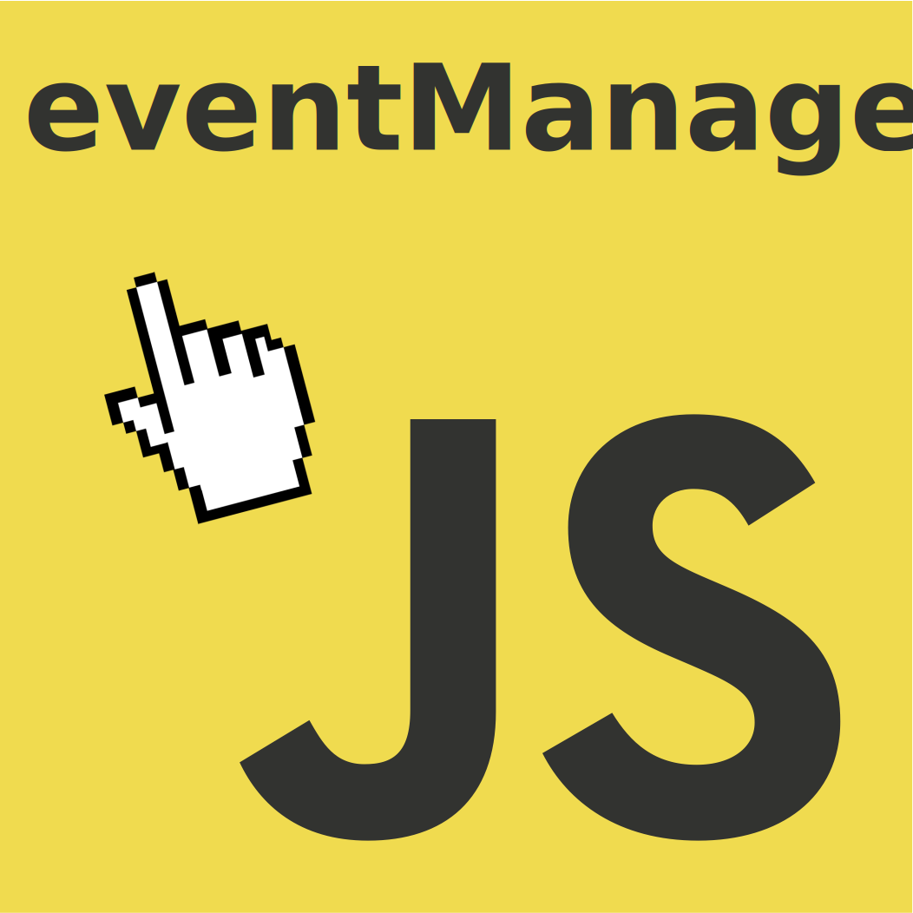

<p style="text-align: center;">

</p>
<br>

# eventManager

> <b>eventManager</b> is a small library written in JavaScript, designed to capture and manage DOM events, and to reassign them functions defined by you. It's simple yet powerful and it only weights 1Kb.

You can also read it in: [Español](README.es.md)

## You can see a [demo online](https://galiprandi.github.io/eventManager/).

---

### How to use:

#### 1) Import the JavaScript library in you page, it will automatically initialize and it will capture every DOM event.

```html
<head>
  <script
    src="https://galiprandi.github.io/eventManager/eventManager.min.js"
    defer
  ></script>
</head>
```

#### 2) Assign the events that you wish to manage, specifying them in HTML attributes. You can use any DOM element as is shown in the following examples, and you can capture any event available in the web browser.

The event names must be prefixed with 'em' so to avoid name collisions with other libraries. E.g., `emClick` captures the 'click' event.

```html
<body emKeyup="handleKeyUp">
  

  <h1 emClick="handleClick">This is a title</h1>

  <button emClick="handleClick">Login button</button>

  <span emClick="handleClick">Simple text</span>
</body>
```

#### 3) Define the functions and the actions the captured events must realize.

```javascript
<script>
  /**************************************************************
    You can access the event itself through the `event` variable. And you can access the node element that triggered the event through `event.target`
  **************************************************************/

  function handleClick(){
    alert(`${event.target.tagName} clicked`)
    console.log(event)
  }

  function handleKeyUp(){
    if (event.key === "F2") {
      // Do something
    }

  }
</script>
```

You can trigger more than one function if you declare them separated by a space as is shown in the following example:

```html
<button emClick="fnOne|fnTwo|fnThree">Login button</button>
```

## ToDo

- [ ] Check compatibility and fix possible bugs.

- [ ] Add features.

- [x] Write documentation.

- [ ] Improve documentation.

- [x] Translate documentation.

## Special thanks to these collaborators:

[Benjamín Lavena](https://github.com/zmasterar)
